# 갤러리 (Gallery)
# 깃허브 작성자
황동석
# 공동 개발자
김기인
# [컨셉]
## 메인 컨셉 : 탈출
-게임 진행 중 유저는 특정 방에서 다음방으로 넘어 가는 데 필요한 단서를 찾을 수 있습니다. 단서의 종류로 열쇠와 힌트가 있습니다. 열쇠의 경우 초반부에는 눈에 잘 띄는 곳에 배치되어 있으나, 나중에는 유저가 방을 수색하여 열쇠를 찾아야 합니다. 힌트의 경우 초반에는 간단한 내용이지만 나중에는 유저가 직접 추리를 해야하는 경우가 많아집니다.
### 1. 서브컨셉 : 손전등
-안개가 자욱하게 깔린 어둠 속에서 유저가 손전등을 의존하게 합니다.

-손전등에 배터리가 존재하며 10퍼씩 닳을 때 마다 밝기가 어두워지며 배터리가 모두 닳게 된다면 게임 오버가 됩니다.

-추가적인 배터리를 제공하여 방을 주기적으로 탐색하게 강제하게 됩니다..

### 2. 서브컨셉 : 사운드
-오브젝트를 획득 할 때마다 각각의 사운드를 재생하며 손전등의 배터리가 적을 경우 긴박한 사운드를 재생합니다.

-긴박한 사운드를 통해서 유저는 게임오버 될 수 있다는 긴박함을 조성합니다.

### 3. 서브컨셉 : 배경
-안개 이펙트 오브젝트와 어두운 빛을 적절히 조화하여 몽환적인 배경을 연출.

### 4. 서브컨셉 : 공포 유발 장식
-조각상, 그림, 화분등 미술관에서 흔히 볼수있는 오브젝트와, 공포를 유발할 수 있는 기괴한 혹은 뒤틀린 조각상, 그림을 배치.

### 5. 서브컨셉: 침대
-시작 시점을 침대를 배치하여 자신의 현재 상황이 꿈이라는 것을 유추할 수 있게 합니다 -세이브 지점을 침대로하여 안전하다는 느낌을 주게 합니다.
# [관련 자료]
## 1. 이미지
-제한된 시야와 그것을 보완할 손전등

-게임의 배경이 될 복도장면

-단서중 일부인 열쇠

## 2. 동영상
### 링크
https://youtube.com/shorts/Yj-VmCbSAd4?si=QwkafeEyrmZQi50U

https://youtu.be/UqWtavRip-8?si=rYiAuqSF71drcRrj

https://youtu.be/zUS83tGi0L0?si=KuAIZN7anZgWN7FP

# [대표 이미지]

-게임 진행중의 한 장면이며 울고있는 그림에 상호작용하는 모습

# [컨셉 & 대표이미지 기반 작품묘사]

> ### 대표이미지 기반 :

> ### 컨셉 기반:

# [갤러리(Gallery) 구성 요소]

- 뒤틀린 예술성이나 감각을 통해 몽환적인 환경을 표현하는 탈출,퍼즐게임

## 1. 메커니즘

### [도전 과제]

1. 플레이어는 손전등의 배터리가 바닥나지않게 유지해야한다.
2. 각 방에 있는 쪽지를 통해 단서를 획득하고 퍼즐을 해결해 나아간다.
3. 타 게임의 HP와 같은 정신력을 최대한 유지하면서 엔딩지점까지 도달해야한다.

### [재미 요소]

1. 게임 진행 중 특정한 방에 작은 조각상(이스터에그)을 획득하며 일정 갯수 획득을 통해 엔딩을 다르게 한다
2. 각 방의 쪽지 내용을 다르게 설정하여 퍼즐게임 특유의 지루함을 방지한다.
3. 손전등의 배터리 잔량에 따라 손전등의 밝기가 어두워지는 것을 통해 긴박감 형성하여 이동할 수 밖에 없게 한다.
4. 기괴한 조각상 근처에 오래 있으면 정신력이 지속적으로 깎이기 때문에 오래있지 않도록 한다.

## 2. 이야기

### [만들게 된 배경]  
평소에 퍼즐 요소를 풀거나 푸는 내용을 보는 것을 좋아하는데 그 과정에서 직접 퍼즐 요소들을 탐구해보고 그 탐구한 내용을 바탕으로 게임에 한번 적용 해보고 싶어서 시작하게 되었습니다.

### [카메라 관점]  
플레이어의 시점을 기준으로 하기 위해 1인칭시점을 제공합니다. 손전등 배터리에 따라서 손전등의 밝기를 조절하고 정신력에 따라서 화면의 시야의 선명도가 조절됩니다.
 
## 3. 미적 요소

### [디자인][컬러]  
처음에는 정상적인 예술품이나 환경이 나타납니다. 그리고 게임을 진행할수록 점점 기괴한 환경이나 예술품이 나오는 식으로 하여 현재 상황을 나타내는 느낌으로 표현합니다. 그리고 맵 후반을 갈수록 어두운 근원에 다가가는 현재상황을 기괴한 예술품들을 통해 표현한다.

### [음향]

뒤틀린 예술성에 대한 웃음이나 그런 분위기를 만들기 위해서 기괴하거나 특이한 BGM이나 사운드를 사용할 생각입니다.

- 기괴한 예술품과 알맞는 음산한 분위기의 사운드를 사용.

- 불쾌한 웃음소리나 긴박함을 표현하는 사운드 사용

## 4. 기술

- 유니티가 제공하는 HDRP기술을 이용하여 그래픽을 한단계 더 발전시켜서 자세하게 표현

- 쉐이더 그래프를 이용하여 알맞은 머티리얼을 사용. 빛의 반사를 이용한 퀄리티 향상

# [게임 오브젝트 분해 및 게임 시스템 디자인]
## 1. 게임 오브젝트 분해

|번호|오브젝트 이름|오브젝트 이미지|
|:----:|:----:|:----:|
|1|플레이어|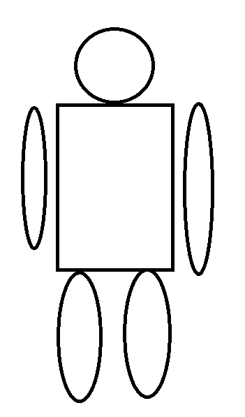|
|2|손전등|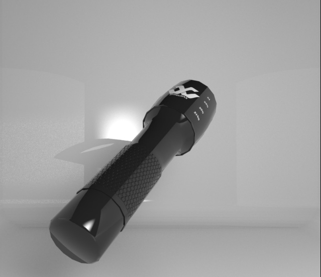|
|3|문|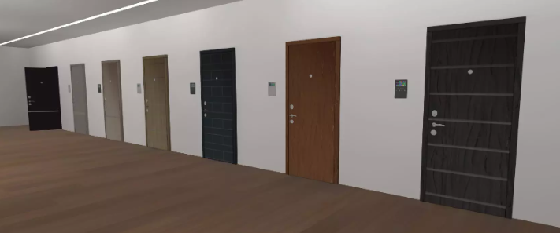|
|4|평범한 조각상|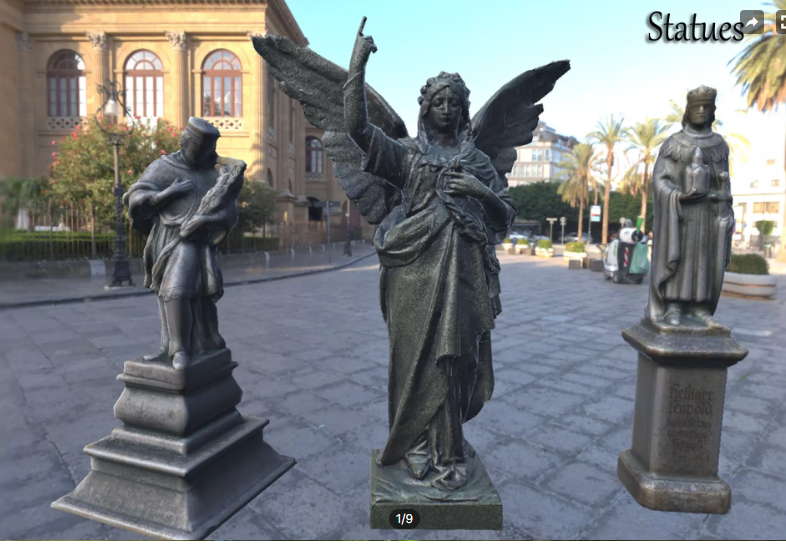|
|5|기괴한 조각상|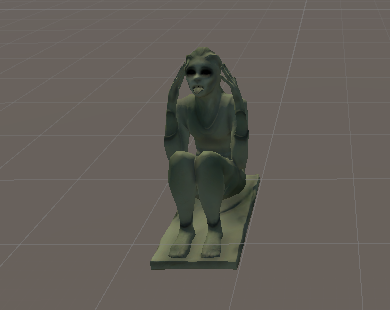|
|6|천사상|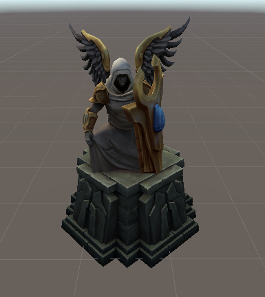|
|7|액자 속 그림||
|8|액자 속 기괴한 그림||
|9|단서||
|10|열쇠|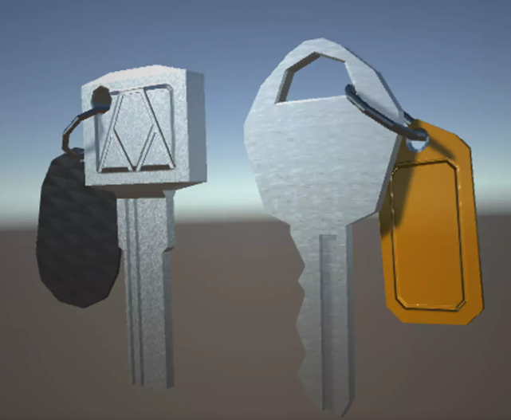|
|11|화분|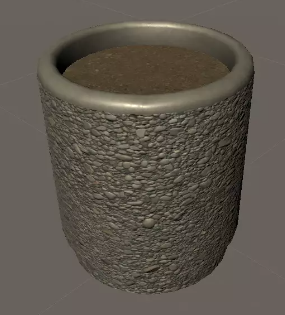|
|12|상호작용 UI E키|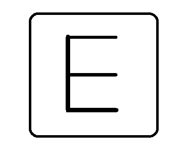|
|13|안개|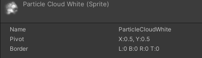|
|14|손전등 배터리|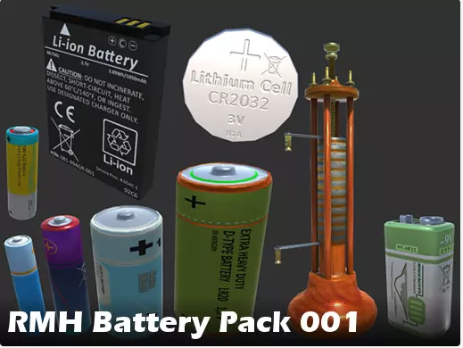|
|15|공포감 조성 소리1||
|16|공포감 조성 소리2||
|17|셰이더 그래프||
|18|시작용 버튼||

## 2. 오브젝트 파라미터(속성) 뽑아보기

### 오브젝트 이름 : Player

|속성|영문 명칭|설명|비고|
|:----:|:----:|:----:|:----:|
|정신력|mental|플레이어의 정신려을 나타내는 수치타 게임의 체력과 유사함||
|스피드|speed|정신력에 따라 달라지는 플레이어 이동속도 속성||
|상호작용|press Button|다른 오브젝트들과 상호작용||
|획득|Get_Item|특정 아이템을 획득 하게한다||

### 오브젝트 이름 : FlashLight

|속성|영문 명칭|설명|비고|
|:----:|:----:|:----:|:----:|
|빛의 세기|light_Intensity|배터리 적을수록 빛의 세기가 약해짐||
|배터리 잔량|light_bettery|배터리 잔량을 나타내는 수치||

### 오브젝트 이름 : 기괴한 조각상

|속성|영문 명칭|설명|비고|
|:----:|:----:|:----:|:----:|
|범위|M_DeBuff|플레이어의 정신력을 감소시킬 수 있는 범위||

### 오브젝트 이름 : 카메라

|속성|영문 명칭|설명|비고|
|:----:|:----:|:----:|:----:|
|레이케스트|rayCast_Range|기괴한 조각상이 레이케스트로 닿을 경우 정신력이 감소||

### 오브젝트 이름 : 문

|속성|영문 명칭|설명|비고|
|:----:|:----:|:----:|:----:|
|애니메이션|Open&Close|플레이어 또는 이벤트로 상호작용 함||

### 오브젝트 이름 : 천사상

|속성|영문 명칭|설명|비고|
|:----:|:----:|:----:|:----:|
|회복|M_Buff|플레이어의 정신력을 회복시킬 수 있는 범위||

### 오브젝트 이름 : 단서

|속성|영문 명칭|설명|비고|
|:----:|:----:|:----:|:----:|
|설명|show|단서에 적힌 내용을 보여줌||

## 3. 행동 뽑아보기

### 오브젝트 이름 : 플레이어

|행동|설명|
|:----:|:----:|
|이동|W,S,A,D로 플레이어 이동 제어|
|상호작용 E|태그에 따라 오브젝트와 상호작용|

### 오브젝트 이름 : 서랍

|행동|설명|
|:----:|:----:|
|상호작용 E|서랍이 열림|

## 4. 상태 뽑아보기

### 오브젝트 이름 : 플레이어

|현상태|전이상태|전이조건|
|:----:|:----:|:----:|
|Neutral|앞으로 이동|W키로 카메라 방향으로 이동|
|Neutral|뒤로 이동|S키로 카메라 반대 방향으로 이동|
|Neutral|왼쪽으로 이동|A키로 카메라의 왼쪽으로 이동|
|Neutral|오른쪽으로 이동|D키로 카메라의 오른쪽으로 이동|
|Neutral|카메라 흐려짐|정신력이 일정 이상 낮아진 경우|
|Neutral|정신력이 떨어짐|기괴한 조각상 범위 안에 있거나 바라볼 경우|
|Neutral|사망|정신력이 모두 없어질 경우|
|카메라 흐려짐|카메라가 선명해짐|정신력이 일정 이상 회복된 경우|
|정신력이 떨어진 상태|정신력이 회복됨|천사상 범위 안에 있을 경우|
|Neutral 및 행동중|상호작용이 일어남|E키를 눌렀을 때 tag가 item, proviso일 경우|
|Neutral 및 행동중|문을 염|E키를 눌렀을 때 tag가 door일 경우|

### 오브젝트 이름 : 손전등

|현상태|전이상태|전이조건|
|:----:|:----:|:----:|
|Neutral|빛을 잃음|배터리를 모두 소진했을 경우|
|빛이 밝음|서서히 빛이 어두워짐|배터리가 일정 이상 낮아질 경우|
|빛이 어두움|빛이 밝아짐|배터리를 획득한 경우|

### 오브젝트 이름 : 문

|현상태|전이상태|전이조건|
|:----:|:----:|:----:|
|문이 닫힘|문이 열림|퍼즐을 해결한 상황에서 플레이어와 상호작용 한 경우|

### 오브젝트 이름 : 작은 조각상

|현상태|전이상태|전이조건|
|:----:|:----:|:----:|
|엔딩에 다다른 경우|진 엔딩|작은 조각상 일정 개수 모은 경우|
|엔딩에 다다른 경우|노멀 엔딩|작은 조각상 일정 개수 모으지 못한 경우|

## 5. 플레이어 캐릭터 속성(파라미터)

|속성|영문 명칭|설명|비고|
|:----:|:----:|:----:|:----:|
|상호작용 키|KeyCode.E|문을 열고 닫을 수 있고, 단서를 획득 할 수 있는 키||
|마우스 민감도|0~100|마우스의 민감도를 설정함||
|위치정보|Transform|캐릭터의 이동을 제어하는 정보||
|정신력|Mental|기괴한 조각상에게서 보호하기 위한 정신력||

## 6. 게임의 규칙

### 핵심 규칙
- 유저는 1인칭 시점 싱글 플레이를 지원함.
- 플레이어는 방마다 존재하는 서로 다른 퍼즐을 풀면서 앞으로 나아가야함.
- 플레이어의 정신력이 0이 이나 손전등의 배터리가 0이 되면 게임오버 상태가 됨.
- 게임 자체의 시간 제한은 없지만 손전등의 배터리를 이용하여 시간 제약을 간접적으로 줌.
- 기괴한 조각상의 범위 안에 플레이어가 있거나 플레이어가 기괴한 조각상을 바라볼 경우 정신력이 감소함.
- 배터리를 획득할 경우 손전등의 배터리가 100%로 충전됨.

### 보조 규칙
- 작은 조각상을 모으면 진엔딩으로 가는 길이 열린다.
-  천사상 범위안에 플레이어가 있을 경우 정신력이 회복됨.

## 7. 게임에서 사용될 공식

### 손전등 배터리 공식
- 배터리의 잔량 = 현재 배터리에서 시간이 지날수록 배터리 잔량이 줄어든다
- 배터리를 획득 → 배터리의 잔량 = Max(100%)
- 배터리 잔량 20% 마다 손전등 빛의 밝기 조절 (총 다섯단계)
- 배터리가 0% 될 경우 손전등이 꺼지면서 게임 오버씬으로 전환

### 정신력 공식
- 기괴한 조각상의 근처에 있을 경우 = 정신력 지속적으로 감소
- 기괴한 조각상을 2초 이상 바라볼 경우 = 정신력 지속적으로 감소
- 천사상 근처에 있을 경우 = 정신력 회복(최대 100)
- 정신력이 50 이하일 경우 = 플레이어의 시야가 흐려짐
- 정신력이 50 초과일 경우 = 플레이어의 시야 원상 복귀
- 정신력이 0이 될 경우 = 시야가 완전히 검게 변하고 게임오버 씬으로 변환

# [요구사항 & 흐름도]
## 1.요구사항
1. (W, A, S, D)키로 플레이어를 이동을 제어 할 수 있다.
2. 1인칭이며 마우스를 따라 이동하는 카메라를 구현한다.
3. E키로 열쇠, 문, 쪽지, 퍼즐, 조각상등 특정 태그가 있는 오브젝트들과 상호작용 할 수 있다.
4. 상호작용이 가능한 오브젝트일 경우 UI화면으로 “E”가 화면의 중앙에 나타난다.
5. 플레이어에게는 100의 정신력이 존재한다.
6. 기괴한 조각상을 2초이상 바라보거나 근처에 있을 경우 정신력이 조금씩 감소한다.
7. 천사상 근처에서만 정신력을 회복시킬 수 있다. 그러나 천사상이 배치되있는 방은 많이 존재하지 않다.
8. 정신력 50이하로 내려가면 시네머신 카메라를 이용해 화면이 흐려진다.
9. 정신력 50이상으로 올라가면 화면이 다시 선명해진다.
10. 정신력이 0이하가 된다면 게임오버 화면으로 씬전환이 이루어진다.
11. 게임 시작 시 시작지점의 탁자 위에서 손전등을 획득 가능하다.
12. 처음 손전등을 획득하면 손전등의 배터리를 15로 초기화 한다.
13. 배터리를 먹으면 손전등의 배터리가 100으로 치환해준다.
14. 손전등의 배터리가 적을수록(20퍼를 기준으로) 손전등의 밝기가 어두워진다.
15. 손전등의 배터리가 0이되면 게임 오버 씬으로 넘어간다.
16. 작은 조각상 20개를 맵 곳곳에 임의로 배치한다.
17. 작은 조각상을 15개 이상 획득할 경우 엔딩이 바뀐다.
18. 작은 조각상을 15개 미만으로 획득했을 경우 엔딩이 바뀌지 않는다.
19. 게임 플레이 도중 잠긴 문을 여는 방법은 두 가지이다.
20. 열쇠를 획득한 뒤 잠긴 문과 상호작용이 가능하다.
21. 퍼즐을 해결할 경우 잠긴 문이 열린다.
22. 쪽지는 각 방마다 무조건 존재하며 쪽지에는 문을 여는 단서가 포함되어있다.
23. 맵 텍스쳐 및 모델링
24. 조명 배치
25. 안개 이펙트 제작
26. 공포감 조성 사운드 배치
27. 플레이어가 지나온 문에 대한 트리거를 발동 시켜 지나온 문을 비활성화 하고 벽으로 치환함.
28. 게임씬은 게임 타이틀, 진엔딩과 노멀엔딩 씬, 게임오버 씬, 플레이 씬 총 5개 씬이 존재한다 
29. 각 방마다 있는 쪽지를 획득하면 나오는 UI(퍼즐 힌트등)
30. 플레이어는 발견되는 쪽지의 내용을 토대로 게임이 진행된다

## 2. 시간별 흐름도 flowchart

## 3. 키보드 이벤트

## 4. 용어 정리

